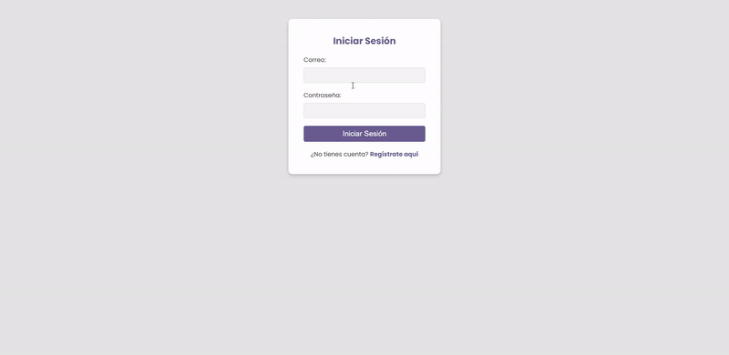
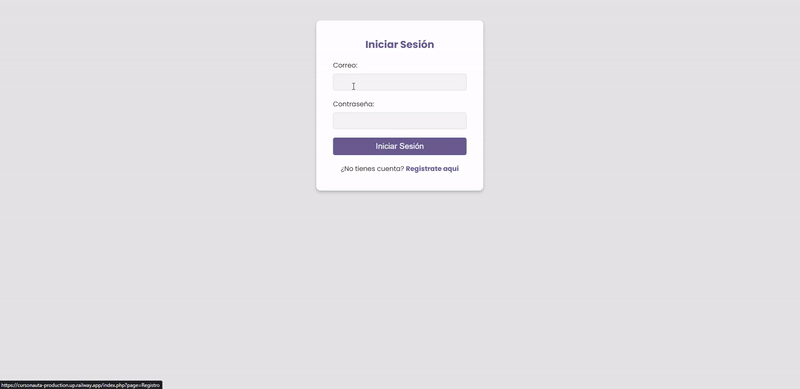

# CursoNauta

Plataforma de cursos en línea con roles de usuario (administrador, instructor, estudiante),
gestión de cursos por niveles, sistema de kardex, pagos y comentarios/valoraciones.

🔗 **[Ver demo en vivo](https://cursonauta-production.up.railway.app)**

## Stack
- **Backend:** PHP (patrón MVC), PDO con procedimientos almacenados
- **Base de datos:** MySQL (transacciones para operaciones multi-tabla)
- **Almacenamiento de media:** Cloudinary (imágenes y video, servidos vía CDN)
- **Deploy:** Railway

## Features
- Autenticación con contraseñas hasheadas (bcrypt vía `password_hash`/`password_verify`)
- Roles diferenciados: administrador, instructor, estudiante, con rutas protegidas por middleware
- Creación de cursos multi-nivel con carga de video e imagen a Cloudinary
- Transacciones SQL para evitar cursos incompletos si falla la creación de algún nivel
- Catálogo de cursos (más vendidos, recientes, mejor calificados) con búsqueda y filtros dinámicos
- Kardex de estudiante y sistema de pagos
- Comentarios y valoraciones por curso, con moderación de administrador

## Notas técnicas
- Los archivos multimedia (video, imágenes de curso, avatares) se almacenan como URLs de Cloudinary en vez de binarios en la base de datos, para mantener las consultas ligeras y aprovechar el CDN.
- Las operaciones de creación de curso están envueltas en una transacción PDO (`beginTransaction`/`commit`/`rollBack`) para garantizar consistencia si algún nivel falla al insertarse.

---
*Proyecto academico desarrollado como práctica de arquitectura MVC en PHP.*
